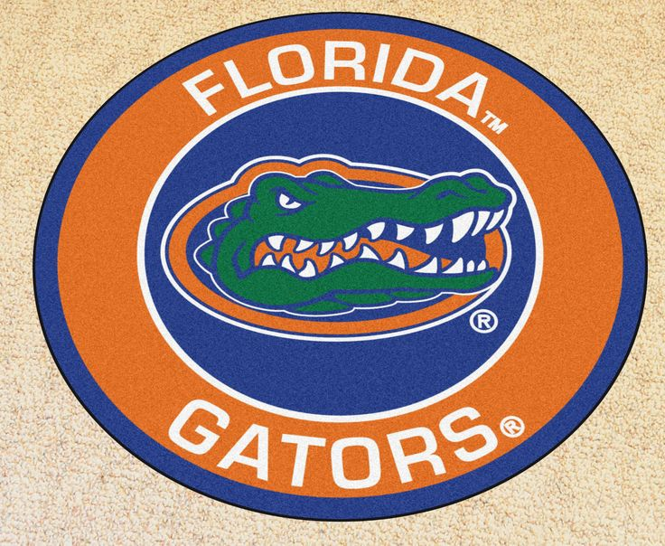

## University Of Florida
- *Graduate Research Assistant* | Apr'23 - Present
- 
- Tags: Research
- Badges:
  - Research [blue]
- List Items:
  - Led the development of advanced crop modeling techniques under Dr. Charlie Messina’s mentorship, utilizing sophisticated tools like Easy Pheno Optimizer and NelderMead Optimizer to refine predictive accuracy.
  - Significantly enhanced crop yield predictions, achieving a 12% improvement in accuracy through advanced Python programming and comprehensive analysis of crop interactions with varying weather conditions and soil types.
  - Pioneered the implementation of innovative crop management strategies, leading to a 20% increase in agricultural yields by optimizing botanical characteristics tailored to specific environmental conditions.

## Darwinbox Digital Solutions PVT LTD
- *Software Development Engineer* | May'22 - Nov'22
- 
- Tags: Full Time
- Badges:
  - Full Time [blue]
- List Items:
  - Served as a key full-stack developer, enhancing and maintaining the company’s HR software using Node.js and Java. Led both front-end and back-end developments, collaborating effectively within a cross-functional team to achieve a 20% improvement in application functionality and customer experience.
  - Designed and executed comprehensive unit testing scenarios using Java, leading to a 30% increase in code coverage. This initiative significantly enhanced the robustness and reliability of the codebase.
  - Integrated and deployed APIs on AWS cloud via CI/CD pipelines, resulting in a 30% reduction in deployment time.
  - Collaborated within cross-functional teams to prioritize code quality and integration in the MVC ecosystem, resulting in a 20% escalation in feature delivery rate.

## Darwinbox Digital Solutions PVT LTD
- *Product Development Intern* | Jan'22 - May'22
- 
- Tags: Internship
- Badges:
  - Internship [blue]
- List Items:
  - Played a pivotal role in product creation as a Product Development Specialist, actively engaged in every stage from concept to market launch. Designed initiatives that accelerated development timelines by 15%, through the implementation of innovative solutions.
  - Gained extensive experience in software lifecycle management, leading efforts to enhance product features and ensure alignment with market demands. These strategic enhancements led to an increase 25% in efficiency and market competitiveness