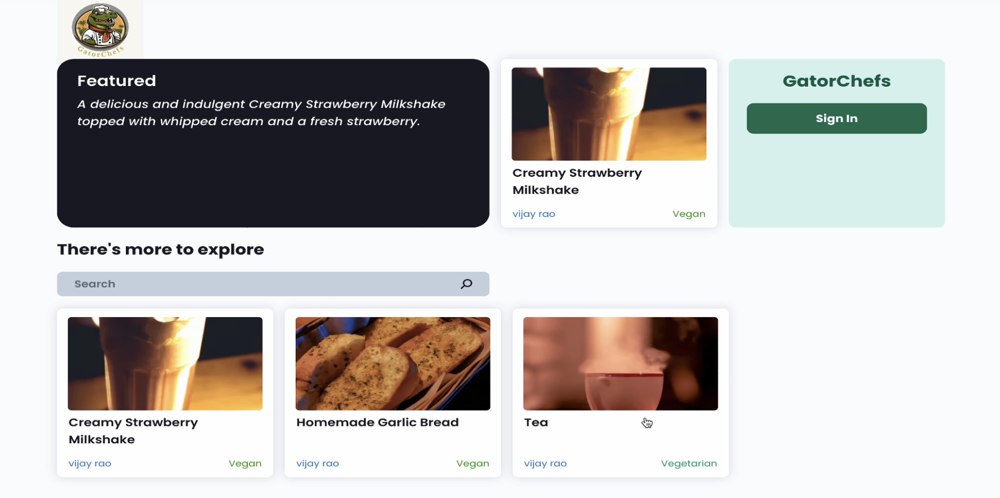
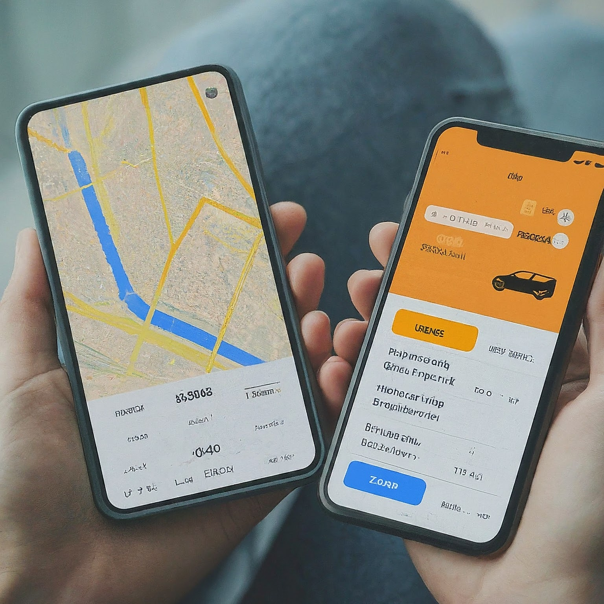

## GatorChefs
Description
- 
- Tags: Web Development
- Badges:
  - ReactJs, NodeJs, MongoDB, CloudFlare, OpenAI [blue]
- Buttons:
  - Link [https://github.com/vijayrao110125/GatorChefs]
- Description1
  - Developed a responsive web app using React.js and Node.js, boosting recipe documentation efficiency by 40% with automatic ingredient extraction via OpenAI, and utilizing MongoDB for scalable user and recipe data storage, improving data management efficiency by 30%.
  - Integrated OAuth for secure account creation and authentication, enhancing user security and accessibility by 25%, and implemented Cloudflare for image storage, reducing image load times by  15% and providing users with flexible options for uploading or generating images based on recipe details.
  - Integrated and deployed APIs on cloud via CI/CD pipelines, resulting in a 30% reduction in deployment time.

## Shopping Through Live Streaming
Description
- 
- Tags: Web Development
- Badges:
  - Java, WebRtc, XML, PHP [blue]
- Buttons:
  - Link []
- Description1
  - Engineered an innovative Android application that integrates live streaming with a rating system, enabling real-time purchasing decisions and enhancing end-user engagement by 30%. Utilized Java, MySQL and PHP.
  - Resulting in a 40% increase in user interaction and a 25% rise in transaction completion rates.Demonstrating effectiveness and efficiency in Consumer engagement and sales processes.

## GatorTaxi
Description
- 
- Tags: Web Development
- Badges:
  - C++, bash, Hipergator [blue]
- Buttons:
  - Link [https://github.com/vijayrao110125/GatorTaxi]
- Description1
  - Architected a cutting-edge ride-sharing program in C++ employing Red-Black Trees and Min-Heaps, achieving logarithmic time complexity (O(log N) to enhance system speed by 20% and ensure seamless customer experience.
  - This resulted in a 50% improvement in ride-matching speeds and a 40% increase in overall system throughput.
  - Optimized ride request management with custom RBT and Min-Heap, yielding a 43% performance boost while synchronizing data structures for efficient ride-sharing services.

## Android Malware Detection
Description
- 
- Tags: Machine Learning
- Badges:
  - Python, Flask, Keras, TensorFlow [blue]
- Buttons:
  - Link []
- Description1
  - Developed a machine learning platform capable of predicting Android app malware with 90% precision, significantly enhancing system security and user trust.
  - Engineered a user-friendly web interface to streamline malware detection, enhancing functionality and user interaction.